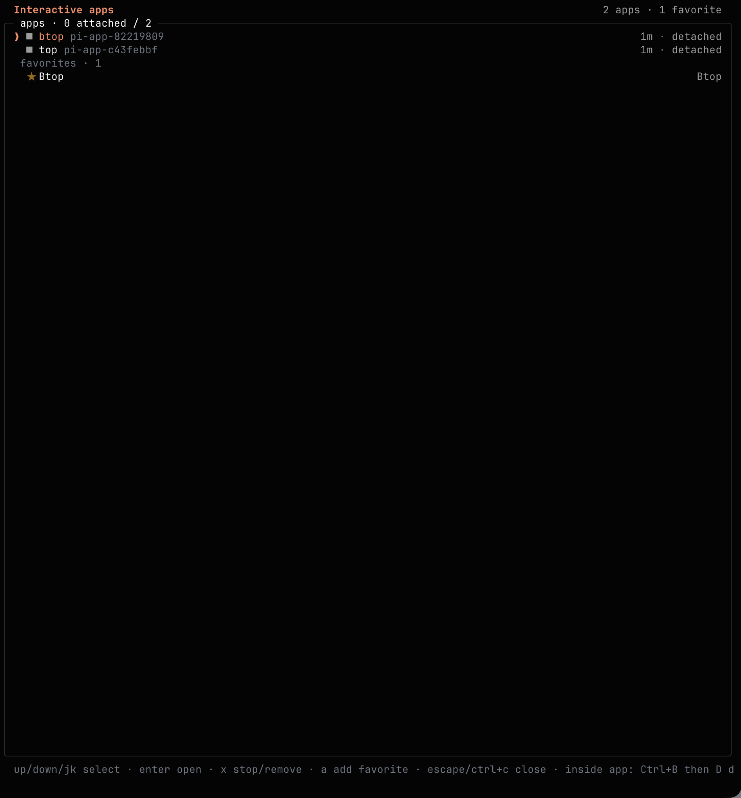

# Pi Interactive Apps

Persistent, project-scoped terminal apps for Pi, backed by a private tmux server.

## Demo

https://github.com/user-attachments/assets/2170da3e-352b-4fd0-913b-ed4f6ce0bb54

### Favorites dashboard



## What it does

- Starts any terminal command with `/app <command>`.
- Attaches immediately with full terminal input.
- Detaches with `Ctrl+B`, then `D`, without stopping the app.
- Reopens detached apps from a full-screen `/app` dashboard.
- Pins favorite commands and starts them in the current project from the dashboard.
- Keeps `/app` scoped to the current project's canonical directory.
- Groups every managed app by canonical project directory with `/app --all`.
- Keeps apps alive across Pi reloads, session changes, and Pi exits.
- Shows the current project's app count in Pi's footer.
- Keeps `/tode` as an alias for `/app tode .`.
- Confirms before stopping an app that may contain unsaved work.

The extension uses `tmux -L pi-apps`, so it never reads or changes sessions on your normal tmux server.

## Requirements

- macOS or Linux
- tmux
- Pi's interactive TUI mode

## Install

```bash
pi install git:github.com/danchamorro/pi-interactive-apps
```

Run `/reload` if Pi is already open.

Try a local checkout without installing it:

```bash
pi -e /path/to/pi-interactive-apps
```

## Use

Start and attach to an app:

```text
/app btop
/app lazygit
```

Inside the app, press `Ctrl+B`, then `D` to detach and return to the dashboard.

Open the current project's dashboard without starting another app:

```text
/app
```

The dashboard opens even when no apps are running. Press `a`, enter a command once, and it stays pinned under favorites. Select a favorite and press `Enter` to start it in the current project. Press `x` to remove a selected favorite.

Open the global dashboard, grouped by canonical project directory:

```text
/app --all
```

`Enter` attaches to the selected app and confirmed `x` stops it, including apps in other project groups.

| Key | Action |
| --- | --- |
| `Up` / `Down` or `k` / `j` | Select an app |
| `Enter` | Attach to an app or start a favorite |
| `a` | Add a favorite command |
| `x` | Ask to stop an app or remove a favorite |
| `Escape` | Return to Pi |

The footer remains current-project only. It shows `apps 2` when two detached apps are running and `apps 2 · 1 attached` when one has an attached tmux client. The status is hidden when the current project has no apps.

## Persistence and recovery

App sessions survive Pi reloads and exits. A reboot or explicit tmux shutdown ends them. Favorites persist in `$PI_CODING_AGENT_DIR/interactive-apps.json`, or `~/.pi/agent/interactive-apps.json` when that environment variable is unset.

Stop every managed app in every project:

```bash
tmux -L pi-apps kill-server
```

This can discard unsaved work.

## Security notes

`/app` runs the command through your login shell. It is a user command, not an LLM-callable tool. The manager stores only encoded project and display metadata in tmux. It removes the full command from the tmux session environment after startup.

Pinned favorites are different: their full commands are stored in the local favorites file so they can be reused. They run only when you select one and press `Enter`. Do not pin commands containing secrets.

Pi packages run with the same system access as Pi. Review extension source before installing it.

## Development

```bash
npm test
```

The test suite has no third-party runtime dependencies.

## License

MIT
